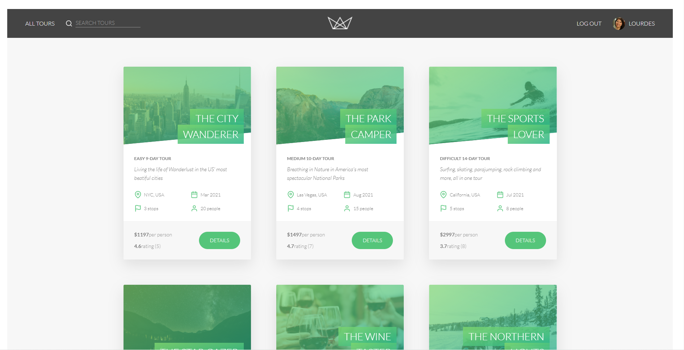

# Natours Project Report
---------------------------------------------------------------

Although this was initially , a udemy course but the design pattern  and use of technology differs as well as the number of added feature both at the backend and frontend


Technologies used:

- ExpressJS
- Javascript
- Monogdb
- Redis
- Socket.io

The project folder directory is divided into

- api = this is virtually the REST API that does all heavy lifting
- client-app =  this provides a sample of  what could be done via a website

## Running this project

To run the project , You should clone it and ensure you have mongodb , redis installed and running on their port 27017 and 
6378

### Running each service independently without Docker

To run the application 

- Running the app: Navigate into the root directory and run
  ```bash
  yarn add  && yarn run  start
  ```


## Problem Solving Approach

Taking a good look on how to implement stripe payment integration with an application and also ensuring the authentication and authorization is sure 


## How the application works

First,  Users signup and then can start viewing tours that potentially interesting , if this suits their needs they can go ahead and buy it.

## What I hope to achieve in the future.

Due to the fact that I will be quite busy with my academics . I hope to complete the user dashboard feature , connect the chatbot with the already implement NPL backend interface for the bot 

## Team behind this project

The team that worked on this project consists of

- Adewole Caleb - Backend & Front.
